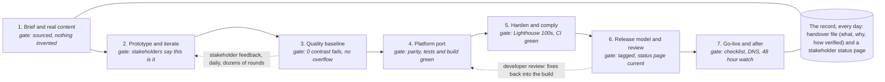

# Website delivery playbook

How the DigiBlu website was delivered (1 to 11 September 2026), written so the same process can be run on the next website, with what to simplify and what to improve. The detail behind every line is in `CLAUDE.md`.

Seven phases, two feedback loops and one working rhythm took a live Wix site to a production-ready Next.js site on Cloudflare in ten days. Each phase ends at a **gate**: a check that was measured rather than eyeballed. The two loops are where most of the time went, and where the quality came from.

## The shape of it

Phases 2 and 3 ran as one loop with the stakeholders. The developer's pre-launch review at phase 6 sent work back into phases 4 and 5. Every decision went into the handover file the same day, and the status page was republished after every change.

## Step by step

| # | Phase | What we did | What it produced | Gate |
|---|---|---|---|---|
| 1 | **Brief and real content** (day 1) | Pulled every word from the live site: services, case studies, team, accreditations, legal documents verbatim. Set the content rules up front: real people and clients only, no fabricated quotes, real links, anonymise where the client asks, no em dashes. | A content inventory, a brand guide as built, the rules that stopped later work drifting. | Every sentence traceable to a source or to the client's own brief. |
| 2 | **Prototype and iterate** (days 1 to 9) | Built the site as one fast static page and put a shareable preview in front of stakeholders every day. Each round: hear the ask, change it, verify it numerically, record why, republish. Design settled through tries and reversals (three About layouts, two Services grids, a nav rebuilt twice), not one big reveal. | The signed-off design, ten case studies, the interaction code, a handover file explaining every choice and reversal. | Stakeholders stopped asking for changes; design declared final and tagged v1.0.0. |
| 3 | **Quality baseline** (alongside 2) | Measured rather than looked: contrast computed from rendered pixels in both themes, layout swept at six widths from 320px, tap targets, keyboard and focus in every dialog, reduced motion, scroll smoothness on a weak tablet, metadata, share cards, structured data. | A written audit baseline to re-run after any styling change; an honest accessibility statement. | Zero contrast failures, no horizontal overflow, every target 24px or more, every dialog clean on Escape. |
| 4 | **Platform port** (day 9) | Took the developer's recommendations (Next.js with server rendering available, markdown content, Cloudflare hosting, Azure for the form) and ported like for like: stylesheet verbatim, each section to a component, content to markdown, each script to a client behaviour, one page per case study and legal document. Kept the old site as the reference until a parity gate compared the two. | A Next.js 16 app, every page prerendered, the Cloudflare Worker runtime configured, a content pipeline with typed loaders. | Parity script clean against the old site; tests and build green; the Worker served every route locally. |
| 5 | **Harden and comply** (days 9 to 11) | Security headers and a strict Content Security Policy, previews noindex, a branded 404, Node pinned, CI. Opt-in cookie consent with Google Consent Mode and analytics gated behind it. Privacy and cookies policy rewritten to what the site actually does, Terms checked against Companies House, a redirect map for the old addresses, Lighthouse run and findings fixed. | A site that can face the public: legally accurate, measured, nothing loading before consent. | Lighthouse 100 on accessibility, best practices and SEO; policy approved by the client; CI green on every push. |
| 6 | **Release model and developer review** (days 9 to 11) | Two branches (dev for UAT, main for production), tagged releases, the old site retired from the tree, a stakeholder status page with owners and priorities. The developer's review then sent work back: real pages under every dialog, a metadata test over the built site, a contact API with Turnstile and a hand-off function for their email call, a contact page. | v2.4.0 on main, 21 crawlable pages, a post-build test guarding metadata, a clear list of what only the developer and the client can do next. | Release tagged; review points closed in writing; status page and handover current. |
| 7 | **Go-live and after** (next) | Runbook: Cloudflare project from the repository, build variables and Worker secrets, custom domain, bulk redirects uploaded, sign-off walk on the preview against the checklist, DNS switched with the old site untouched until that moment, 48 hours of watching, Search Console and analytics proven on the live domain. | A step list anyone can follow; the items that remain with the client and the developer. | Checklist signed, live domain answers, redirects verified, form sends, analytics reports. |

### The rhythm inside every round

1. Hear the ask in the client's words and restate it as a measurable outcome.
2. Change the smallest thing that meets it.
3. Verify with a number, not a glance: contrast, pixels, counts, a test, a Lighthouse score.
4. Write down what changed, why, and what it was measured against, in the handover file.
5. Republish the preview and the status page, so anyone can see where things stand without asking.

## Next time

### Simplify

- **Start on the platform.** The static prototype was fast to iterate but cost a full port (phase 4) and a retirement. Prototype inside Next.js with markdown content from day one; the iteration speed is the same.
- **Pages first, dialogs second.** Every piece of content gets its own page from the start; dialogs are an enhancement over real links. This build learned it at the review.
- **Get the accounts on day one.** Cloudflare, analytics, Turnstile, domain and DNS access were the blockers at the end. Ask for them in the brief.
- **Decide the awkward content early.** Anonymisation, client quotes, photographs and approvals; placeholders that arrive late linger into launch.
- **Script the share cards.** Generate them in a build step instead of a browser routine.
- **Review on a real preview URL.** Connect the host early so the client reviews a branch preview, not a rebuilt artifact.

### Enhance

- **A template repository.** Consent and analytics, security headers, the page metadata test, the contact API trio, CI, the runbook, the checklist and this playbook, with placeholders. New site: fill in content and brand.
- **Quality in CI, not by hand.** Lighthouse with budgets, screenshot comparison at the six widths, the contrast audit as a test.
- **Real accessibility testing.** A screen-reader pass and an independent audit before launch; a pause control on any moving strip.
- **Operate it.** Rate limiting on the API, uptime monitoring, Search Console and error alerts from launch day, consented analytics events on the form and the CTAs.
- **Editing for non-developers.** Markdown behind a small editor or a pull-request flow so the client can change copy without a developer.
- **Less client JavaScript.** The first-visit banner is the phone's largest paint; trim the scripts and the score follows.

## The reusable kit

| Piece | Where it lives | What it gives you |
|---|---|---|
| Handover file | `CLAUDE.md` | Every decision with its reason and its measurement. The one document that lets anyone pick the site up. |
| Status page | Published page for stakeholders | Done and outstanding with owners and priorities, republished after every change. Stakeholders stop asking. |
| Content pipeline | `content/`, `scripts/build-content.cjs`, `lib/content.ts` | Markdown with JSON-quoted front matter, folded into one module before every build and test. |
| Consent and analytics | `lib/consent/`, `components/consent/` | Opt-in banner, Consent Mode v2, analytics that loads only after a yes. Lift onto any site by editing one config file. |
| Security headers | `next.config.ts` | Strict CSP, HSTS, framing and permissions policies, noindex on previews. |
| Contact API | `app/api/contact/route.ts`, `lib/contact/` | Validate, verify Turnstile, hand off to one function the developer fills. Test keys for local work. |
| Page metadata test | `scripts/pages.test.cjs` | Over the built output: title, description, canonical, share card, structured data, sitemap, for every page, in CI. |
| Sign-off checklist | `docs/parity-checklist.md` | What a person with a browser checks before go-live. |
| Cut-over runbook | `CLAUDE.md`, runbook section | Host setup, variables and secrets, redirects, DNS, the watch. |
| Redirect map | `docs/redirects/` | Old addresses to new, in the host's bulk format, with the reasoning beside it. |

## Gates, as a checklist

Tick these in order on the next site. If one cannot be ticked, the next phase has not started.

- [ ] Every sentence sourced; the content rules written down
- [ ] Design declared final by the stakeholders and tagged
- [ ] Contrast 0 failures in both themes, no overflow from 320px, targets 24px
- [ ] Every dialog keyboard-operable, focus returns, reduced motion respected
- [ ] Every piece of content has its own page with its own metadata and card
- [ ] Tests, build and host bundle green in CI on every push
- [ ] Consent gates every third-party script; the policy says what the site does
- [ ] Lighthouse 100 on accessibility, best practices and SEO; performance understood
- [ ] Two branches, tagged releases, old site retired, status page current
- [ ] Accounts, keys and DNS access in hand before the go-live week
- [ ] Sign-off walk on the real preview, phone and desktop, both themes
- [ ] Redirects uploaded, DNS switched, 48 hours watched, analytics proven live
